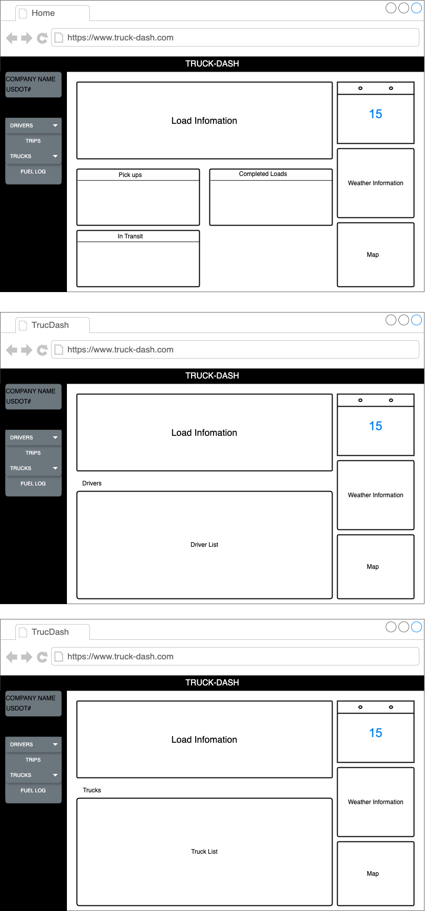

# Truck-Dash
**About**

Truck Dash is a web app that Will help trucking companies keep track of their daily operations in real-time.

## Technologies Used

### Front-End

  <code></code>
  <code></code>
  <code></code>
  <code></code>
  <code></code>
  <code></code>
  <code></code>

### Back-End

  <code></code>
  <code></code>
  <code></code>
  <code></code>
  <code></code>

## Entity Relationship Diagram (ERD)
.png)

## Wireframe

